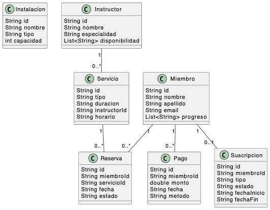

# Plataforma de Bienestar

Este proyecto es una aplicación web basada en Spring Boot que proporciona una plataforma para la gestión de bienestar, que incluye un catálogo de servicios, gestión de reservas, perfiles de miembros e instructores, y más.

## Funcionalidades Principales

- **Catálogo de servicios y actividades**: Presenta un listado de los servicios y actividades disponibles en la plataforma, como clases grupales y sesiones individuales.
- **Sistema de reservas**: Los usuarios pueden reservar clases o sesiones individuales de acuerdo a sus preferencias.
- **Gestión de perfiles**: Los administradores pueden gestionar los perfiles de miembros e instructores, editar información y seguir el progreso de los usuarios.
- **Programación de recursos**: Los administradores pueden asignar instalaciones y equipos a actividades específicas.
- **Sistema de suscripciones**: Los usuarios pueden suscribirse a diferentes planes (mensual, anual, etc.) y realizar pagos en línea.
- **Recomendaciones personalizadas**: Basado en las actividades y el perfil del miembro, el sistema ofrece recomendaciones adaptadas.

## Diagrama de Clases

Inserta aquí tu diagrama de clases como imagen:

```bash

```

## Estructura del Código

```bash
src/
├── main/
│   ├── java/
│   │   └── com/
│   │       └── jererg/
│   │           └── plataformabienestar/
│   │               ├── controllers/
│   │               ├── models/
│   │               ├── repositories/
│   │               └── services/
│   └── resources/
│       └── templates/
└── test/
```

## Endpoints de la API

### Servicios

- **GET** `/api/servicios` - Obtiene todos los servicios disponibles.
- **POST** `/api/servicios` - Crea un nuevo servicio.

### Miembros

- **GET** `/api/miembros` - Obtiene todos los miembros registrados.
- **POST** `/api/miembros` - Crea un nuevo miembro.

### Instructores

- **GET** `/api/instructores` - Obtiene todos los instructores.
- **POST** `/api/instructores` - Crea un nuevo instructor.

### Instalaciones

- **GET** `/api/instalaciones` - Obtiene todas las instalaciones.
- **POST** `/api/instalaciones` - Crea una nueva instalación.

## Pruebas Unitarias

Se han implementado pruebas unitarias para los principales endpoints utilizando el framework de Spring Boot Test.

```bash
src/test/java/com/jererg/plataformabienestar/controllers/
```

## Documentación de Swagger

El proyecto utiliza Swagger para la generación automática de la documentación de la API. Para acceder a la documentación, visita:

```bash
http://localhost:8080/swagger-ui/
```

## Decisiones de Diseño

- Se eligió **Spring Boot** por su simplicidad para crear aplicaciones web robustas.
- Se utiliza **MongoDB** como base de datos no relacional para almacenar información de los servicios, miembros, instructores, etc.
- **Thymeleaf** se eligió como motor de plantillas para la capa de presentación.

## Desafíos y Soluciones

- **Asignación de recursos**: Fue complejo coordinar la asignación de instalaciones a servicios sin conflictos de horarios. Esto se resolvió implementando validaciones y verificaciones de disponibilidad.
- **Recomendaciones personalizadas**: Implementar un sistema que se adapte al perfil del miembro requirió crear un algoritmo basado en las preferencias y actividades previas de los usuarios.

## Instalación y Ejecución

1. Clona este repositorio:
    ```bash
    git clone https://github.com/JereRG/UNSTA/tree/main/BackEnd/TP2/plataformabienestar
    ```
2. Navega al directorio del proyecto:
    ```bash
    cd plataformabienestar
    ```
3. Ejecuta la aplicación:
    ```bash
    mvn spring-boot:run
    ```

## Contribuciones

Las contribuciones son bienvenidas. Por favor, crea un fork del proyecto, realiza tus cambios y abre un Pull Request.
